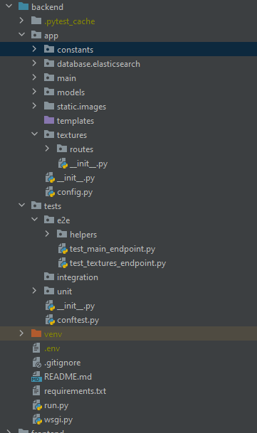

# Visao Coding Challenge
## Backend

1. Go to backend directory.
   - cd backend
   
2. Create new virtual env.
   - python -m venv venv
   
3. Activate virtual env.
    - source venv/bin/activate for MacOs
    - venv\Scripts\activate for Windows
   
4. Install requirements.
    - pip install -r requirements.txt
   
5. Set up your .env file. I will contact you with the values.
    
5. Run the app.
    - python run.py || flask run || le bouton play vert en haut !
    - running on http://localhost:5000/
 

## Tests
1. Go to backend directory.
   - cd backend
   
2.Run pytest command.
    - pytest

## Deployment

API is deployed on Render.
- https://visaoapi.onrender.com/

## Comments

J'ai déjà beaucoup d'expérience avec Flask et Python donc ca s'est déroulé très naturellement. Toute les routes CRUD ont été crées, ce qui m'a permis de facilement interagir avec ma BD à l'aide de Postman. Tout d'abord j'ai réfléchi à quelle serait la meilleure manière de stocker et chercher ce data.json la de textures. Au début il était stocké sur MongoDb dans le cloud mais j'ai finalement opté pour ElasticSearch puisqu'elle me paraît plus rapide et plus adapté à ce type de travail. Comme je viens de compléter le cours de bases de données avancées la session passé ou on a appris ElasticSearch justement, ca m'a permis de trouver une bonne solution efficace et rapide.

Le projet a été fait avec toujours en tête une mentalité de bonne architecture, clean code et de scalability dans le temps. 
J'ai donc utilisé des blueprints pour séparer les routes et comme vous pouvez le constater l'architecture du projet est très détaillé
pour un si petit projet de manière à ce que ca soit facilement scalable et maintenable.

## Architecture

