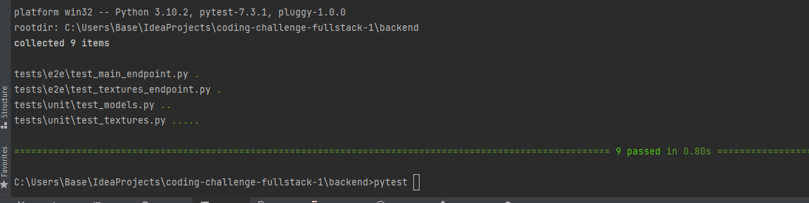

# Visao Coding Challenge
## Backend

1. Go to backend directory.
   - cd backend
   
2. Create new virtual env.
   - python -m venv venv
   
3. Activate virtual env.
    - source venv/bin/activate for MacOs
    - venv\Scripts\activate for Windows
   
4. Install requirements.
    - pip install -r requirements.txt
   
5. Set up your .env file. I will contact you with the values.
    
5. Run the app.
    - python run.py || flask run || le bouton play vert en haut !
    - running on http://localhost:5000/
 

## Tests
1. Go to backend directory.
   - cd backend
   
2.Run pytest command.
    - pytest

## Comments