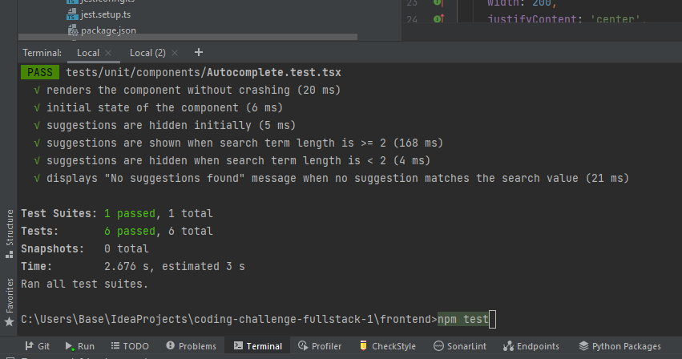
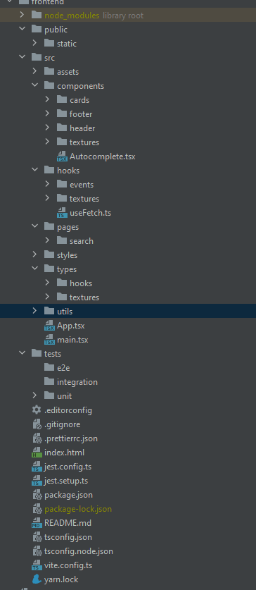

# Visao Coding Challenge
## Frontend

1. Go to frontend directory.
    - cd frontend
   
2. Install dependencies.
   - npm install
   
3. Run the application.
    - npm run dev 
    - running on http://localhost:5173/

## Tests
1. Go to frontend directory.
   - cd frontend

2. Run test command.
   - npm test

## Deployment

Frontend is deployed on Vercel.
- https://coding-challenge-fullstack-1.vercel.app/

## Comments

J'ai eu beaucoup de fun a expérimenter avec les différentes technologies du projet.
J'ai utilisé react-native-web pour profiter de la puissance de react-native et de ses 
composants ainsi que pour la responsiveness(et si je suis honnête c'est aussi que j'avais 
lu dessus je trouvais ca cool et j'attendais une bonne opportunité de l'essayer !)

- Aucune librairie UI n'a été utilisé pour le design SAUF pour les sphères 3D qui sont générées par Three.js. 
  De plus, c'était la première fois que j'utilisais Three donc ca m'a permis de découvrir cette librairie là.

Concernant l'architecture du projet, à chaque quelques lignes de code je pense constamment à la maintenabilité et
à la scalabilité et je fais des modifications en découpant les components en fonction de leur responsabilité 
ou en séparant de longues classe/fonctions en plusieurs morceaux par exemple. 

L'API est deployer aussi pour pouvoir tester le tout sur une single page sans perdre de temps.

## Architecture

